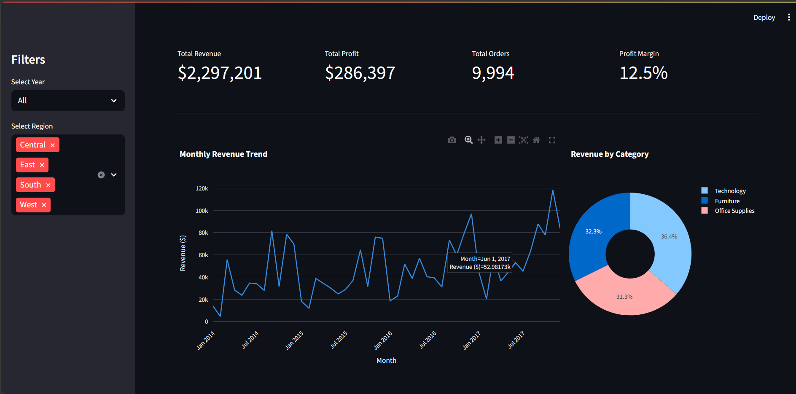

# 📊 Retail Sales Performance Dashboard

An interactive business intelligence dashboard built with Python, SQL, and Streamlit — analyzing **$2.3M in retail sales** across 4 regions, 3 product categories, and 4 years of data.

**[🔗 Live Demo](#)** — http://192.168.1.9:8502

---

## 📸 Dashboard Preview



---

## 🔍 Key Business Insights

After analyzing 9,994 orders, three major findings emerged:

- **Furniture is a silent loss-maker** — generates $742K in revenue but only $18K profit (2.5% margin), while Technology earns $145K profit from similar sales. High discounting (17.4% avg) is killing the margins.
- **West and East drive 62% of total revenue** — Central and South are significantly underperforming despite being large markets.
- **Sales grew 8x from 2014 to 2017** — November 2017 alone hit $118K, compared to just $14K in January 2014.

---

## 🛠️ Tech Stack

| Tool | Purpose |
|------|---------|
| Python | Core programming language |
| Pandas | Data cleaning and manipulation |
| SQLite + SQLAlchemy | Database storage and SQL queries |
| Plotly | Interactive charts |
| Streamlit | Dashboard web application |

---

## 📁 Project Structure

```
retail-sales-dashboard/
├── data/
│   ├── Superstore.csv       # Raw dataset (9,994 rows)
│   └── sales.db             # SQLite database (auto-generated)
├── setup.py                 # Loads CSV into SQLite database
├── explore.py               # SQL analysis and insight discovery
├── app.py                   # Streamlit dashboard application
└── README.md
```

---

## 🚀 How to Run Locally

**1. Clone the repository**
```bash
git clone https://github.com/yourusername/retail-sales-dashboard.git
cd retail-sales-dashboard
```

**2. Install dependencies**
```bash
pip install pandas sqlalchemy streamlit plotly
```

**3. Download the dataset**

Download the [Superstore dataset from Kaggle](https://www.kaggle.com/datasets/vivek468/superstore-dataset-final) and place it in the `data/` folder.

**4. Load data into database**
```bash
python setup.py
```

**5. Run the dashboard**
```bash
streamlit run app.py
```

Open your browser at `http://localhost:8501`

---

## 📊 Dashboard Features

- **KPI Cards** — Total revenue, profit, order count, and profit margin at a glance
- **Monthly Trend Chart** — Revenue growth from 2014 to 2017
- **Category Donut Chart** — Revenue split across Technology, Furniture, Office Supplies
- **Region Bar Chart** — Performance comparison across West, East, Central, South
- **Profit by Category** — Shows margin % on each bar so the Furniture problem is immediately visible
- **Top 10 Products** — Most profitable individual products
- **Interactive Filters** — Filter by year and region — all charts update instantly
- **Raw Data Table** — Scrollable view of the underlying orders

---

## 💡 What I Learned

- Writing SQL queries to extract business insights from raw transactional data
- Building an end-to-end data pipeline from CSV → SQLite → Python → Dashboard
- Identifying non-obvious business problems (high revenue ≠ high profit)
- Deploying a data application as a shareable web app

---

## 📦 Dataset

- **Source:** [Superstore Sales Dataset — Kaggle](https://www.kaggle.com/datasets/vivek468/superstore-dataset-final)
- **Size:** 9,994 orders, 21 columns
- **Period:** January 2014 — December 2017
- **Region:** United States (West, East, Central, South)

---

## 👤 Author

**Your Name**
- GitHub: [@yourusername](https://github.com/yourusername)
- LinkedIn: [your-linkedin](https://linkedin.com/in/yourprofile)

---

*Built as a data science portfolio project — 3rd year undergraduate*